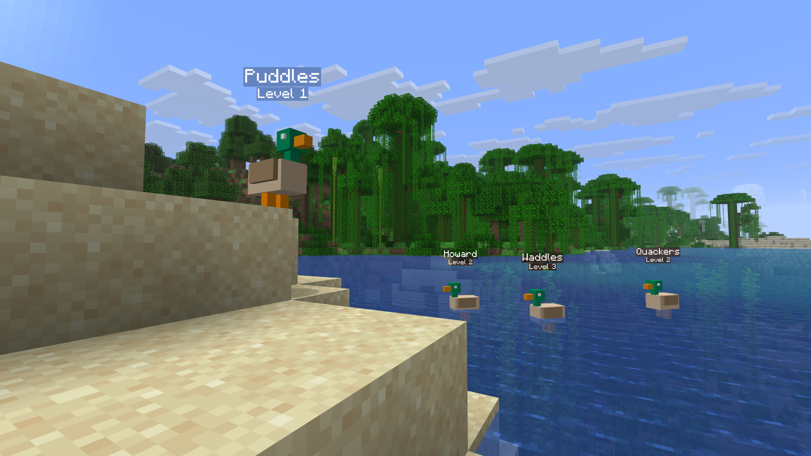
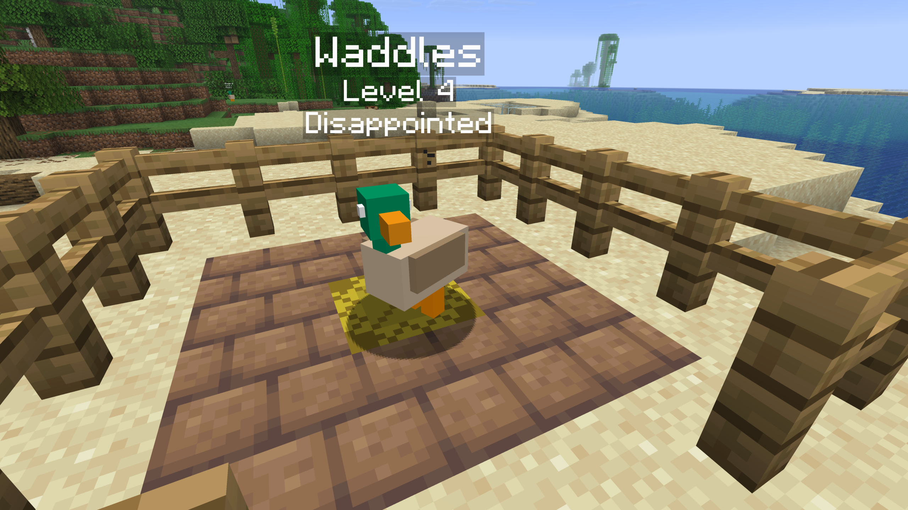
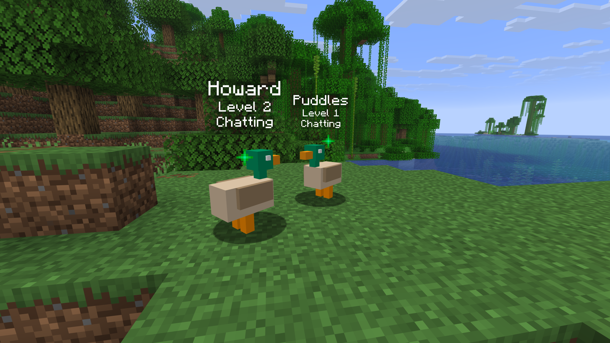

# Anatidaephobia
Anatidaephobia is a Minecraft mod that adds ducks with complex behavior systems and progression mechanics. See also the [website](https://anatidaephobia.studer.dev) and [documentation](https://anatidaephobia.studer.dev/docs).

## Screenshots

	
	

	
	

## Requirements
* Minecraft 1.21.11
* Fabric Loader 0.18.2 or later
* Fabric API 0.139.5+1.21.11 or later
* Java 21

## Features

### Ducks
* Procedurally generated names
* Tracked stats: hunger, stress, loneliness, experience
* Behavioral AI including nesting, destressing, and socializing
* Interactive UI for viewing duck status

### Resources
* Raw Quackmium obtained from ducks
* Quackmium Ingots crafted by smelting
* Quackmium Blocks for storage
* Quackmium Armor set

### Mechanics
* Duck nesting system with quality scoring
* Nest lining crafting and placement
* Duck eggs and spawning
* Player interactions with brushes and shears
* Wrath of the Duck Gods status effect triggered by duck deaths
